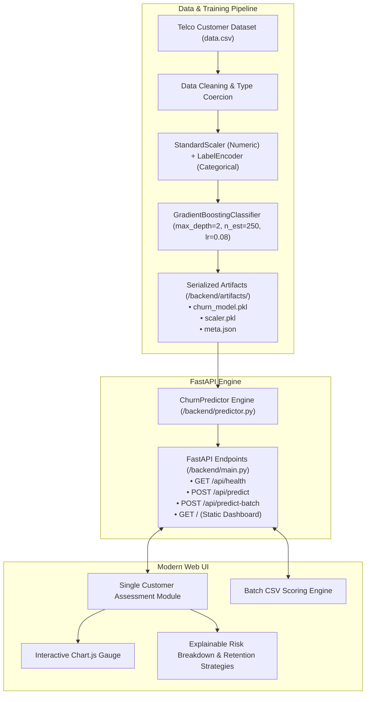

# 📡 Telecom Customer Churn Prediction & Retention AI Platform

> **An End-to-End Enterprise Machine Learning Platform for Telecom Customer Churn Forecasting, Explainable Risk Diagnostics, and Prescriptive Retention Action Recommendations.**

[](https://fastapi.tiangolo.com)
[](https://scikit-learn.org/)
[](https://www.python.org/)
[](LICENSE)
[]()

---

## 📌 Table of Contents
- [1. Executive Overview](#-1-executive-overview)
- [2. System Architecture](#-2-system-architecture)
- [3. Exploratory Data Analysis & Key Findings](#-3-exploratory-data-analysis--key-findings)
- [4. Machine Learning & Model Engineering](#-4-machine-learning--model-engineering)
- [5. Prescriptive AI & Risk Diagnostics Engine](#-5-prescriptive-ai--risk-diagnostics-engine)
- [6. REST API Reference](#-6-rest-api-reference)
- [7. Web Dashboard & User Experience](#-7-web-dashboard--user-experience)
- [8. Project File Structure](#-8-project-file-structure)
- [9. Getting Started & Installation](#-9-getting-started--installation)
- [10. Testing & Validation](#-10-testing--validation)

---

## 🚀 1. Executive Overview

Customer churn occurs when subscribers discontinue doing business with a telecom service provider. In the telecommunications sector, annual churn rates range from **15% to 25%**, costing companies millions in lost annual recurring revenue (ARR).

Acquiring a new telecom subscriber is **5× to 7× more expensive** than retaining an existing one. This platform bridges the gap between predictive machine learning and actionable customer success by:
1. **Predicting Churn Risk:** Accurately classifying whether a subscriber is likely to leave using an optimized Gradient Boosting ensemble.
2. **Explainable AI Diagnostics:** Pinpointing the exact factors driving churn probability (contract duration, billing method, add-on coverage).
3. **Prescriptive Interventions:** Automatically generating business-tailored retention actions (e.g., targeted contract upgrade discounts, complimentary support trials, automated billing incentives).

---

## 🏗️ 2. System Architecture



---

## 🔍 3. Exploratory Data Analysis & Key Findings

From empirical analysis of the 7,043 customer records across 21 demographic, service, and billing attributes:

| Feature Dimension | Key Observation | Business Implication |
| :--- | :--- | :--- |
| **Contract Type** | **75%** of churned customers are on *Month-to-month* contracts vs. only **3%** on *Two-year* contracts. | Long-term contract incentives are the strongest retention anchor. |
| **Tenure** | Peak churn occurs in the first **1–6 months** of customer onboarding. | Onboarding lifecycle support directly impacts long-term customer lifetime value (LTV). |
| **Payment Method** | Customers using manual *Electronic check* churn at **2.5×** the rate of automated payment methods. | Switching customers to automated ACH/credit card billing significantly dampens churn. |
| **Service Add-ons** | Customers on *Fiber optic* without *Tech Support* or *Online Security* exhibit high churn rates. | High bandwidth creates high performance expectations; bundling technical assistance is critical. |
| **Monthly Charges** | Subscribers billed **>$80/month** display heightened price sensitivity and churn likelihood. | Proactive account optimization prevents churn caused by price creep. |

---

## 🤖 4. Machine Learning & Model Engineering

### Model Selection & Cross-Validation Benchmarks
Multiple classification algorithms were trained and benchmarked using stratified K-fold cross-validation:

| Model | Accuracy (%) | ROC-AUC (%) | Key Characteristic |
| :--- | :---: | :---: | :--- |
| **Gradient Boosting Classifier (Tuned)** | **80.66%** | **84.11%** | **Production Champion:** Optimal balance of discrimination and calibration |
| AdaBoost Classifier | 80.45% | 84.05% | Strong performance on hard boundary examples |
| Soft Voting Ensemble (GBC + LR + AdaBoost) | 80.68% | 84.10% | Robust ensemble generalization |
| Logistic Regression | 80.32% | 83.90% | Linear baseline with high interpretability |
| Random Forest Classifier | 79.80% | 82.30% | Strong variance reduction |
| K-Nearest Neighbors (KNN) | 76.50% | 79.10% | Sensitive to dimensional noise |

### Production Hyperparameters (`backend/export_model.py`)
```python
GradientBoostingClassifier(
    max_depth=2,
    n_estimators=250,
    learning_rate=0.08,
    random_state=42
)
```

### Feature Importance Weights
```
Contract           ██████████████████████████████████ 35.7%
tenure             ██████████████████ 18.4%
MonthlyCharges     ██████████████████ 18.1%
TotalCharges       ████████ 8.3%
OnlineSecurity     ███████ 7.5%
TechSupport        ██████ 6.5%
PaymentMethod      █ 1.3%
SeniorCitizen      █ 1.2%
```

---

## 🎯 5. Prescriptive AI & Risk Diagnostics Engine

Unlike standard "black-box" churn models, this platform includes an automated decision-support engine (`backend/predictor.py`):

1. **Risk Stratification:**
   - **High Risk ($\ge 60\%$ Probability):** Immediate churn intervention required.
   - **Moderate Risk ($35\% - 59\%$ Probability):** Early warning stage; proactive engagement recommended.
   - **Low Risk ($< 35\%$ Probability):** Healthy, loyal customer account.

2. **Explainable Risk Factor Diagnostics:** Evaluates the customer profile and identifies specific friction points (e.g., *Unsupported High-Speed Service*, *Short Tenure Risk*, *Electronic Check Friction*).

3. **Prescriptive Action Generator:** Matches identified risk triggers to actionable, ROI-positive customer retention offers:
   - *Month-to-month Contract* $\rightarrow$ **15% promotional discount on 1-year contract upgrade**.
   - *No Tech Support on Fiber* $\rightarrow$ **3-month complimentary VIP Tech Support & Security trial**.
   - *Electronic Check* $\rightarrow$ **$10 one-time bill credit for switching to Auto-Pay**.

---

## 🔌 6. REST API Reference

The backend provides production-grade endpoints documented via interactive Swagger UI at `/docs`.

### `GET /api/health`
Returns system status, active model type, and validation metrics.

### `POST /api/predict`
Calculates churn probability, risk level, diagnostic factors, and retention strategies for an individual subscriber.

**Request Body (`application/json`):**
```json
{
  "gender": "Female",
  "SeniorCitizen": "No",
  "Partner": "No",
  "Dependents": "No",
  "tenure": 3,
  "PhoneService": "Yes",
  "MultipleLines": "No",
  "InternetService": "Fiber optic",
  "OnlineSecurity": "No",
  "OnlineBackup": "No",
  "DeviceProtection": "No",
  "TechSupport": "No",
  "StreamingTV": "Yes",
  "StreamingMovies": "No",
  "Contract": "Month-to-month",
  "PaperlessBilling": "Yes",
  "PaymentMethod": "Electronic check",
  "MonthlyCharges": 85.50
}
```

**Response (`200 OK`):**
```json
{
  "churn_prediction": "Yes",
  "churn_code": 1,
  "churn_probability": 73.3,
  "retention_probability": 26.7,
  "risk_level": "High Risk",
  "risk_color": "#ef4444",
  "risk_factors": [
    {
      "factor": "Contract Type",
      "impact": "High Risk Driver",
      "detail": "Customer is on a Month-to-month plan with no long-term commitment."
    },
    {
      "factor": "Short Tenure",
      "impact": "High Risk Driver",
      "detail": "Active for only 3 month(s); onboarding phase has peak churn risk."
    }
  ],
  "retention_strategies": [
    {
      "title": "Contract Transition Incentive",
      "action": "Offer a 15% discount for upgrading to a 1-year or 2-year contract plan.",
      "priority": "High Priority"
    }
  ],
  "metrics": {
    "accuracy": 80.66,
    "roc_auc": 84.11
  }
}
```

### `POST /api/predict-batch`
Upload a `.csv` dataset file to score hundreds of subscribers simultaneously with aggregated churn statistics and preview tables.

---

## 🖥️ 7. Web Dashboard & User Experience

Built with vanilla modern HTML5, CSS3, and JavaScript:
* **Dark Glassmorphic Aesthetic:** Professional enterprise telemetry theme with responsive layout.
* **Quick Presets:** Instant evaluation using preloaded profiles:
  - ⚠️ *High Risk Churner*
  - ⚡ *Moderate Risk*
  - 🛡️ *Loyal Customer*
* **Dynamic Sliders & Value Syncing:** Interactive tenure and monthly charges sliders with live total estimation.
* **Animated Probability Gauge:** Real-time semi-doughnut meter rendered with Chart.js.
* **Batch Drag-and-Drop:** CSV upload zone with live client-side scoring summaries.

---

## 📂 8. Project File Structure

```
Telecom_Customer_Churn_Prediction/
├── .gitignore                   # Project gitignore configuration
├── requirements.txt             # Python dependencies
├── run.py                       # One-click application launcher
├── README.md                    # Comprehensive technical documentation
├── data.csv                     # Telco churn reference dataset
│
├── backend/
│   ├── __init__.py
│   ├── main.py                  # FastAPI application routes & middleware
│   ├── predictor.py             # Inference pipeline & prescriptive logic
│   ├── schemas.py               # Pydantic data validation models
│   ├── export_model.py          # Standalone training & artifact export
│   └── artifacts/
│       ├── churn_model.pkl      # Serialized Gradient Boosting model
│       ├── scaler.pkl           # StandardScaler numeric transformer
│       └── meta.json            # Model metadata, metrics & mappings
│
├── frontend/
│   ├── index.html               # Web dashboard markup
│   ├── styles.css               # Glassmorphic UI styles & responsive CSS
│   └── app.js                   # UI controllers, Chart.js & API client
│
└── Scripts/
    └── Customer churn prediction.ipynb  # Exploratory data analysis & model experiments
```

---

## ⚡ 9. Getting Started & Installation

### Prerequisites
- Python 3.9, 3.10, or 3.11
- Git

### 1. Clone the Repository
```bash
git clone https://github.com/sAkhil2027/Telecom_Customer_Churn_Prediction.git
cd Telecom_Customer_Churn_Prediction
```

### 2. Create and Activate Virtual Environment
```bash
# Windows
python -m venv venv
.\venv\Scripts\activate

# Linux / macOS
python3 -m venv venv
source venv/bin/activate
```

### 3. Install Dependencies
```bash
pip install -r requirements.txt
```

### 4. Launch the Application
```bash
python run.py
```

* **Interactive Web Dashboard:** [`http://127.0.0.1:8000`](http://127.0.0.1:8000)
* **Swagger API Documentation:** [`http://127.0.0.1:8000/docs`](http://127.0.0.1:8000/docs)
* **ReDoc API Documentation:** [`http://127.0.0.1:8000/redoc`](http://127.0.0.1:8000/redoc)

---

## 🧪 10. Testing & Validation

### Standalone Inference Verification
Execute a verification test from your command line:
```bash
python -c "from backend.predictor import ChurnPredictor; p = ChurnPredictor(); print(p.predict({'gender':'Female','SeniorCitizen':'No','Partner':'No','Dependents':'No','tenure':3,'PhoneService':'Yes','MultipleLines':'No','InternetService':'Fiber optic','OnlineSecurity':'No','OnlineBackup':'No','DeviceProtection':'No','TechSupport':'No','StreamingTV':'Yes','StreamingMovies':'No','Contract':'Month-to-month','PaperlessBilling':'Yes','PaymentMethod':'Electronic check','MonthlyCharges':85.5,'TotalCharges':256.5}))"
```

### Retraining the Model
To retrain and re-export model artifacts:
```bash
python backend/export_model.py
```

---

## 📄 License
This project is licensed under the MIT License - see the [LICENSE](LICENSE) file for details.
